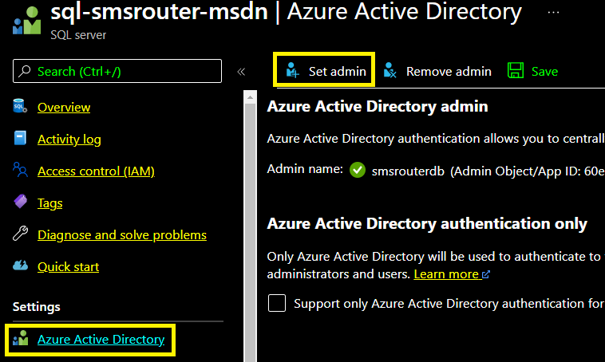

# SMS Router
## Detailed Design
## Rob Bowman
## 28/06/21

 

# Introduction
The purpose of the SMS Router application is to provide a consistent method for sending SMS messages from Leeds City Council.

 

## Key Requirements
+ Changeable service provider (Gov Notify is the 1st)
+ Support for Templated messages
+ Support for Simple messages
+ Ability to enquire on status of previously submitted request

 

# HLD

# Visual Studio Solution

The solution comprises the following folder and projects:

+ SmsRouter.Core - c# Library Project
  + interface definition for external services
  + the core of the solution - has no project dependencies
  + contains Entity Framework model classes (POCOs) in *Domain* folder
  + contains *OpenApiDef* folder with the Open Api (Swagger) definition and c# code that is generated from this using NSwagStudio 

 

+ SmsRouter.AzFunc - Azure Functions Project
  + HttpSms.cs contains both of the sms send functions (http trigger)
    + SendSimpleSms
    + SendTemplateSms
    + Both functions are called with a Post. The expected parameters are documented by the Open API Definition. The key difference is that for *SendSimpleSms* the post body simply contains a *messageBody* string value whereas for *SendTemplateSms* the body must contain the TemplateId of the template to be used plus the string values (templateParameters) that are to be substituted into the template
    + Both functions follow the same pattern
      + Call UTRN service to obtain a unique reference number assigned to the request
      + Persist the request to a database (Azure Sql Server)
      + Queue the request onto an Azure Storage Queue
      + Return an ok status to the caller along with the UTRN
    + QueueAndHttpOutputType Return Type
      + This is a custom return type that enables the http triggered functions to return the ok http response AND queue the request ready for the *QueueOrchestration* function (see below)
  + SmsOrchestrator.cs - contains QueueOrchestration function
    + This is triggered by publication of request to Azure Storage Queue by either *SendSimpleSms* or *SendTemplateSms* http triggered functions 

 

+ Infrastructure - Folder Containing Proxies for External Services
  + Azure Sql Server via Entity Framework
  + Gov Notify Sms Service
  + Utrn Service

 

+ SmsRouter.UnitTest - XUnit Project
  + most focused of the tests projects with no dependencies outside of solution
+ SmsRouter.IntegrationTest - XUnit Project
  + contains tests to prove integration with external dependencies such as database, utrn and gov notify services
+ SmsRouter.ManualTests
  + contains tests designed be triggered manually from Visual Studio after first starting a separate instance of the function app
    + start a VS 2019 instance, load the solution
    + hit ctrl + F5, the function app should start along with the Azure Storage Emulator
    + start a second VS 2019 instance
    + run the manual tests from the Test Explorer window

# Database
The application makes use of a database to record the state of sms requests that have been processed. Azure offers multiple database options but Azure Sql was selected for the following:
+ low cost
+ proven support from Entity Framework
+ existing expertise in support of Sql Server databases

## Design
The following diagram shows how Entity Framework models the database from the *Domain* classes of the *SmsRouter.Core* C# Library project

The main table is *SmsOrder*. This contains columns for each of the fields received in the client's request made to our *SendSimpleSMS* or *SendTemplateSms* functions. From the main table, foreign key columns give access to the supporting *Tag* and *TemplateParameter* tables.

## Authentication
The app authenticates with the database through Azure Active Directory Managed Identity. This requires a "Contained User" to be created - the identity of which the application will use when connecting to the database.

### Creating the Azure AD Sql Admin

 This is documented [here](https://docs.microsoft.com/en-us/azure/azure-sql/database/authentication-aad-configure?tabs=azure-powershell#azure-ad-admin-with-a-server-in-sql-database) but in summary:

+ a new Azure AD account is created, to be the Admin for the Azure Sql Server instance
+ from the Sql Server Instance Azure Portal Page
  + Azure Active Directory is selected
  + Set admin is selected

### Creating the Contained User
Microsoft documentation can be found [here](https://docs.microsoft.com/en-us/azure/azure-sql/database/authentication-aad-configure?tabs=azure-powershell#create-contained-users-mapped-to-azure-ad-identities).

With the Admin set, the contained user for the function app can be created. This can be done by:
+ using Sql Server Management Studio to connect to the Azure Sql Instance giving the newly created Sql Admin Azure AD credentials and selecting "Azure Active Directory - Password" from the "Authentication" list box
+ creating the new managed identity and assigning permission to *Execute* stored procedures as follows:

~~~~sql
CREATE USER [func-smsrouter-msdn-01] FROM EXTERNAL PROVIDER 

ALTER ROLE db_datareader ADD MEMBER [func-smsrouter-msdn-01] 
ALTER ROLE db_datawriter ADD MEMBER [func-smsrouter-msdn-01] 

-- Create a db_executor role
CREATE ROLE db_executor

-- Grant execute rights to the new role
GRANT EXECUTE TO db_executor
ALTER ROLE db_executor ADD MEMBER [func-smsrouter-msdn-01]  
~~~~

# Updating From Open API (Swagger) Spec
There are two reasonable approaches to developing the code and interface specification (to be shared with consumers of the api):
+ code first
+ contract first

## Code First
Following this approach, the C# code would be manually decorated with attributes that can be process by a tool in order to build an interface specification to be consumed by clients

### Pros
+ reduced complexity - less manual intervention since the C# code is the single source of truth
+ reduced possibility of errors - due to single source of truth

### Cons
+ can only be authored by the C# developer
+ after generating the Open Api specification, this would need to be shared with potential consumers somehow

## Contract First
Following this approach, the interface specification is first developed using a human friendly tool such as SwaggerHub. The yaml definition is then exported and processed through a tool to generate the C# code that implementing the Api endpoints and types.

### Pros
+ interface specification can be authored by non-developer
+ arguably easier to express intent of the api using an editor such as that provided by SwaggerHub where the author is one step removed from the implementation detail

### Cons
+ after authoring the interface specification the implementation code (C#) needs to be generated. This presents additional manual steps and possibility for errors since it potentially removes the single source of truth

### Tooling
A couple of tools were investigated to support the Contract First Approach
+ VS Code Azure Function Generation [here](https://www.youtube.com/watch?v=4fPRxveXGXw&t=135s)
+ NSwag Studio [here](https://docs.microsoft.com/en-us/aspnet/core/tutorials/getting-started-with-nswag?view=aspnetcore-5.0&tabs=visual-studio)

Both tools are provided by Microsoft an both were found to be effective. However, the VS Code approach wasn't a great fit since the it generates the functions but is not aware of the fact that we depend on composite output bindings (to write to a queue and return a response).

Generating the C# from NSwag Studio was found to be simple. It generated a single class that contained the types for input and output of the http operations. The relative potential drawback to the NSwag Studio approach is that the Azure Function's http trigger definitions have to be manually code but this was simple eg:

~~~~c#
[Function(nameof(SendTemplateSms))]
        public async Task<QueueAndHttpOutputType> SendTemplateSms([HttpTrigger(AuthorizationLevel.Anonymous, "post", Route = "v1.0/template-sms")] HttpRequestData req,
            FunctionContext executionContext)
~~~~

## Selected Process
After evaluation of the options described in the previous sections, the following workflow for updates to the interface specification was followed:
+ changes authored in SwaggerHub (could also use Azure APIM but SwaggerHub has better editor)
+ exported as "Yaml Resolved" into Visual Studio Solution: SmsRouter.Core\OpenApiDef
+ yaml saved to Visual Studio Solution: SmsRouter.Core\OpenApiDef\SmsRoutingOpenApi3.yaml. The NSwag project (\NSwag\NSwagProjext.nswag) is already defined to expect the yaml file in this location 
+ from within NSwagStudio, select Outputs\CSharp Controller and click "Generate Files"
+ this generates the C# defining the types for payload received and responses to be provided, into the file: SmsRouter.Core\OpenApiDef\NSwag\Generated.cs
+ the generated types can be easily referenced by the http triggered Azure Functions, as shown below:

~~~~c#
public async Task<QueueAndHttpOutputType> SendSimpleSms([HttpTrigger(AuthorizationLevel.Function, "post", Route = "v1.0/simple-sms")] HttpRequestData req,
            FunctionContext executionContext)
        {
          ...
          SimpleSms sendSimpleSmsRequest = JsonConvert.DeserializeObject<SimpleSms>(reqBody);

~~~~

SimpleSms is defined in OpenApiDef\NSwag\Generated.cs as shown below
~~~~c#
[System.CodeDom.Compiler.GeneratedCode("NJsonSchema", "10.4.3.0 (Newtonsoft.Json v12.0.0.0)")]
    public partial class SimpleSms 
    {
        [Newtonsoft.Json.JsonProperty("requestConfig", Required = Newtonsoft.Json.Required.DisallowNull, NullValueHandling = Newtonsoft.Json.NullValueHandling.Ignore)]
        public BaseFields RequestConfig { get; set; }
    
        [Newtonsoft.Json.JsonProperty("messageBody", Required = Newtonsoft.Json.Required.DisallowNull, NullValueHandling = Newtonsoft.Json.NullValueHandling.Ignore)]
        public string MessageBody { get; set; }
    
        private System.Collections.Generic.IDictionary<string, object> _additionalProperties = new System.Collections.Generic.Dictionary<string, object>();
    
        [Newtonsoft.Json.JsonExtensionData]
        public System.Collections.Generic.IDictionary<string, object> AdditionalProperties
        {
            get { return _additionalProperties; }
            set { _additionalProperties = value; }
        }
    }
~~~~

### Configuring Azure API Management
The yaml specification can be imported into api management by selecting APIs\+ Add API\Create from definition - OpenAPI\Select a file. From here browse to the yaml that was previously exported from Swagger Hub and added into the Visual Studio solution.

A screencast showing generation of C# and import of yaml into APIM can be seen [here](./ExportingYamlFromSwaggerHub.mp4)

